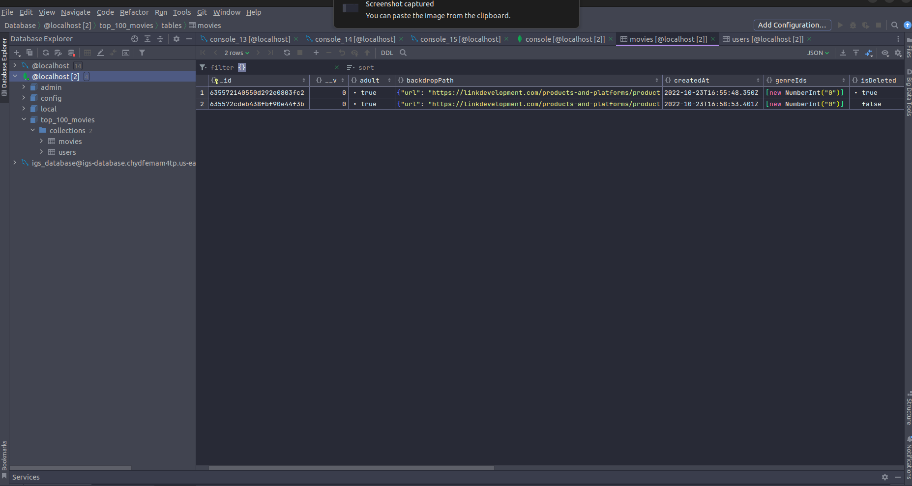

# Top 100 Movies

## Clone & Start

1. **Clone**: `git clone git@github.com:ezzatmakar/Top100Movies.git`.
2. **Install Dependencies** : `yarn install`.
3. **Create .env file**: duplicate `.env-example` and rename it to `.env` and open it, change the values.
4. **Run Development**: `yarn start:dev`.
5. **Run Production**: `yarn build`, after that `yarn start`.
6. You can you docker for build and run.

## Live Demos
> **Note that:** I exposed **RESTful** APIs 

1. [Api Docs]()

## Schema with NoSQL
[Open Details](./schema-with-no-sql.md)

## Notes
1. Authentication is ignored
2. I didn't cover all the test cases, I wrote some examples.
3. I made some assumptions:
   - A user can only rank a movie once
   - Also, the rank must be in the range of 1 up to 100.
   - if the user ranks a movie with the same value as another movie, I replace it with the new one.
4. I choose NoSQL because I have a database server for it.
5. I added pipeline for testing with github action.

## What I did do to develop the code?

1. I took between 2h to 3h for planning and designing the schema.
2. Developing models (schemas) took 2h.
3. Develop Movie CRUD operations and its test case take from 6h up to 8h, I implemented RESTful APIs.
4. User Movies rank took 3h up to 4h.
5. Take a look and refactor the code, It took 3h.
